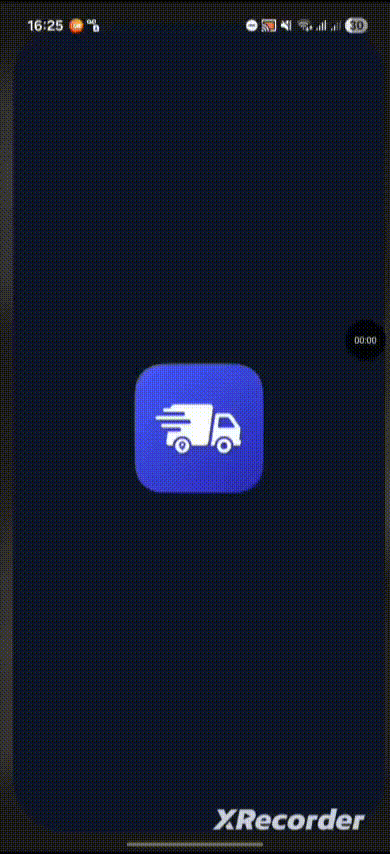
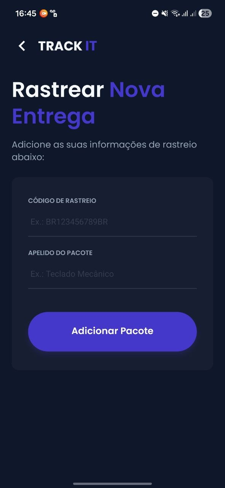
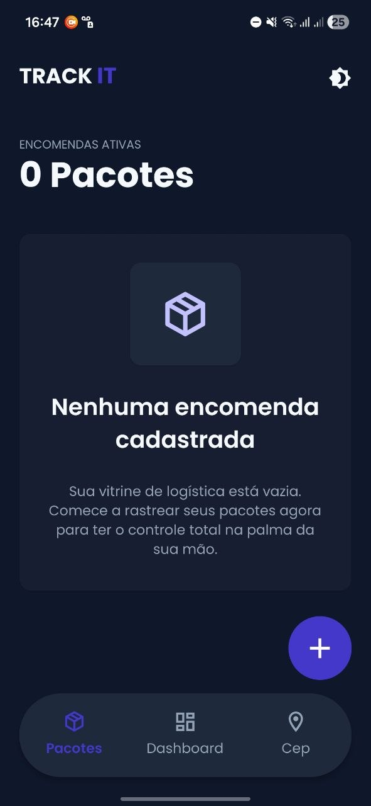
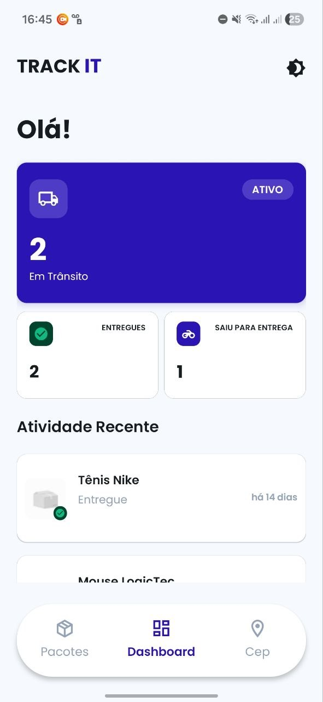
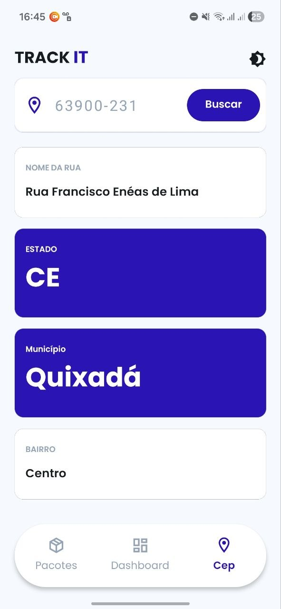

# TrackIt

Aplicativo mobile desenvolvido com React Native (Expo) para rastreamento de encomendas, consulta de CEP e visualização de status em tempo real.

---

## Sobre o projeto

O **TrackIt** é um app que permite ao usuário:

* Rastrear encomendas através de código de rastreio
* Consultar informações de endereço via CEP
* Visualizar status das entregas (em trânsito, saiu para entrega, entregue)
* Armazenar pacotes localmente no dispositivo
* Acompanhar atividade recente

O projeto foi desenvolvido com foco em:

* UI moderna e responsiva
* Experiência do usuário fluida
* Organização de código (separação de camadas)

---

## Tecnologias e bibliotecas

### Core

* React Native (Expo)
* Expo Router
* TypeScript

### UI e Estilização

* StyleSheet (React Native)
* Tema customizado (light/dark)

### Animações

* Lottie (lottie-react-native)

### Requisições

* Axios

### Armazenamento

* AsyncStorage

### Outros

* expo-clipboard
* expo-splash-screen
* expo-google-fonts (Poppins)
* react-native-toast-message

---

## Funcionalidades

### Rastreamento de encomendas

* Integração com API de rastreio
* Conversão de dados da API para modelo interno

---

### Consulta de CEP

* Busca de endereço por CEP
* Tratamento de erros (CEP inválido / não encontrado)
* Exibição condicional de dados
* Copiar endereço para área de transferência

---

### Dashboard

* Resumo de encomendas
* Contagem por status
* Atividade recente

---

### Armazenamento local

* Salvamento de pacotes com AsyncStorage
* Recuperação automática ao abrir o app

---

### Splash Screen animada

* Splash nativa + splash customizada
* Animação com Lottie (caminhão)

---

## Fluxo de dados

1. Usuário insere código de rastreio
2. App chama API
3. Dados são transformados (mapper)
4. Pacote é salvo localmente
5. Home e Dashboard exibem os dados

---

## Demonstração

<p>
  
</p>

<p>
  
  
  
  
</p>


---

## Como rodar o projeto

```bash
# instalar dependências
npm install

# rodar em modo desenvolvimento
npx expo start

---

## Autor

Desenvolvido por **Alexander Kerner** 🚀

---

## Licença

Este projeto é apenas para fins educacionais.
